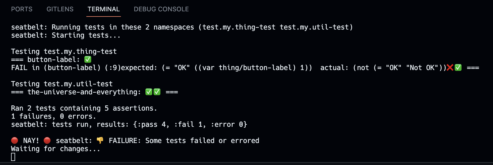

# Seatbelt – A Joyride Test Runner

A test runner for your [VS Code](https://code.visualstudio.com/) extensions and/or [Joyride](https://marketplace.visualstudio.com/items?itemName=betterthantomorrow.joyride) scripts. Seatbelt is itself a Joyride script and thus runs in VS Code ([@vscode/test-electron](https://www.npmjs.com/package/@vscode/test-electron) to be precise). It supports both one-off runs, e.g. for CI, and running as a watcher on file system changes.

## Installation

NB: To take the Seatbelt for a spin you'll need `npm`, `yarn`, or whatever you prefer for installing npm dependencies command line tool.

1. Fork and clone this repo (yes, you want a fork for the [CI example](#run-in-ci) below.)
1. Install dependencies:
   ```sh
   npm i
   ```

## A one-off run

```sh
npm test
```

This will install a local copy of VS Code (separate from any VS Code you may have installed) and run the few (and silly) example tests in this project. The tests are here: [.joyride/src/test](.joyride/src/test).

### Run in CI

The project includes configuration for GitHub Actions.

1. Create a git branch
1. Change something
1. Push your changes to your fork

This should run the tests on GitHub. You probably will need to enable it on yor fork for this to happen.


### The Test Watcher

Running the tests in watch mode is more fun in a VS Code integrated terminal:

1. `npm run watch-tests`

This will start the separate VS Code instance, and it will run the tests and then the test runner will be waiting for files to change. 

2. Save a file to see the test run with success again.
2. Change some code to make a test fail and save the file to see (and hear) the test run fail.
   
2. Fix the bug and save again, just for the fun.

## Using for your projects

1. Copy the [.joyride/src/seatbelt](.joyride/src/seatbelt) folder to the `.joyride/src/` folder of your project.
1. Copy the `scripts` from this project's `package.json` to your projects ditto.
   * Adjust the script names as needed.
1. You will also need the devDependencies used by Seatbelt: 
   ```sh 
   npm i @vscode/test-electron @w72/cross-env --save-dev
   ``````
1. Tell Seatbelt when your script is ready to run the tests by calling:
   ```clojure
   (seatbelt.runner/ready-to-run-tests! "Workspace activated.")
   ```
   (Typically from your `workspace_activate.cljs` script. See [.joyride/scripts/workspace_activate.cljs](.joyride/scripts/workspace_activate.cljs))

## Install globally

If you use the test runner for your Joyride scripting you probably want to install it as a User script.

1. Copy the [.joyride/src/seatbelt](.joyride/src/seatbelt) folder to your User Joyride `src` directory (e.g. `~/.config/joyride/src/` on Mac and Linux).
1. Adjust the paths to `launcher.js` in the `package.json` scripts

It will depend on wether you are using the test runner for your User scripts or for Workspace scripts what the paths should be. Also, if it is for User scripts, you need to also adjust the `workspace` path towards the bottom of the [src/seatbelt/launcher.js](.joyride/src/seatbelt/launcher.js) script to correctly find the workspace root of your Joyride User scripts.

## Projects using Seatbelt

Even though Seatbelt is newly published as a standalone project, versions of it has been in use for quite some time:

* In Calva it is used for [end-to-end testing](https://github.com/BetterThanTomorrow/calva/tree/published/src/extension-test/e2e-test)
* Joyride uses it for its [integration tests](https://github.com/BetterThanTomorrow/joyride/tree/master/vscode-test-runner)

Seatbelt is also used for the new project [Backseat Driver](https://github.com/PEZ/backseat-driver). Since this is a Joyride script, it is used for the [unit testing](https://github.com/PEZ/backseat-driver/tree/master/.joyride/src/seatbelt) (well, very few tests so far, but there's going to be some coverage eventually.). There is nothing stopping us to use it for both integration and e2e tests too, of course. Eventually, eventually.

* Your project here ...

## Notes

**The `JOYRIDE_HEADLESS` environment variable.** When Seatbelt runs the tests it should have the `JOYRIDE_HEADLESS` environment variable set. This lets the Joyride scripts under test prevent running code that shouldn't be run by the test runner. In this repository the variable is set by the `scripts` in [package.json](package.json). Here's the relevant example code in [workspace_activate.cljs]() for conditionally requiring a namespace:

```clojure
(defn- -main []
  (println "Test Runner Example Workspace: -main called")
  (if js/process.env.JOYRIDE_HEADLESS
    (println "HEADLESS TEST RUN: Not Initializing Interactive things.")
    (do
      (println "Initializing interactive things...")
      ; Beware of the Gilardi scenario: https://technomancy.us/143
      (require '[my.thing])
      ((resolve 'my.thing/init!))))
  (seatbelt.runner/ready-to-run-tests! "Workspace activated."))

(when (= (joyride/invoked-script) joyride/*file*)
  (-main))
```

You may have noticed that VS Code is not required for taking Seatbelt for some spins. The launcher takes care of installing a local VS Code for running the tests in.

Joyride scripting is [Clojure](http://clojure.org) coding and that is much nicer with the [Calva](https://marketplace.visualstudio.com/items?itemName=betterthantomorrow.calva) extension. And the [Calva API:s](https://calva.io/api/)) is great for Joyride scripts that support your Clojure(Script) coding.

## Happy Testing! ❤️

Issues and Pull requests welcome. Preferably in that order.

As may be obvious from this README: An unsolved problem is the distribution of this script. People will be running with their copies and will need to manually update as the test runner is improved. If you have ideas for how to solve this, I'd love to hear!

See typos? Please PR.

## License

This project is licensed under the MIT License - see the [LICENSE](LICENSE) file for details.